# O aplikácii
RealChat je jednoduchá desktopová chat aplikácia určená na end-to-end šifrovanú komunikáciu a zdieľanie súborov, ktorá je kompletne napísaná v programovacom jazyku Java. Jej hlavným cieľom je ponúknuť užívateľom väčšie pohodlie, súkromie a bezpečnosť komunikácie v dobe, kedy je táto otázka stále viac aktuálnejšia.

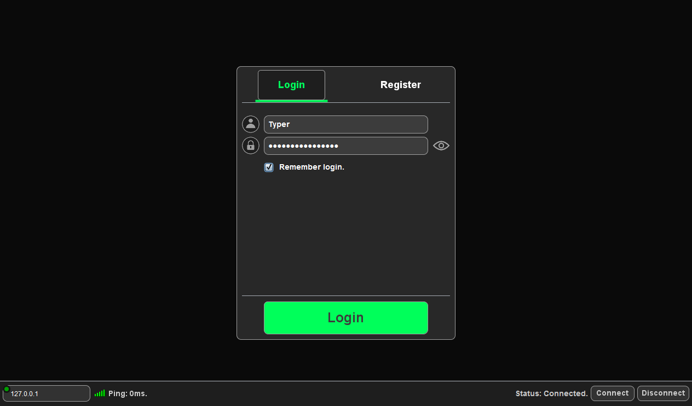
Náhľad po prihlásení:
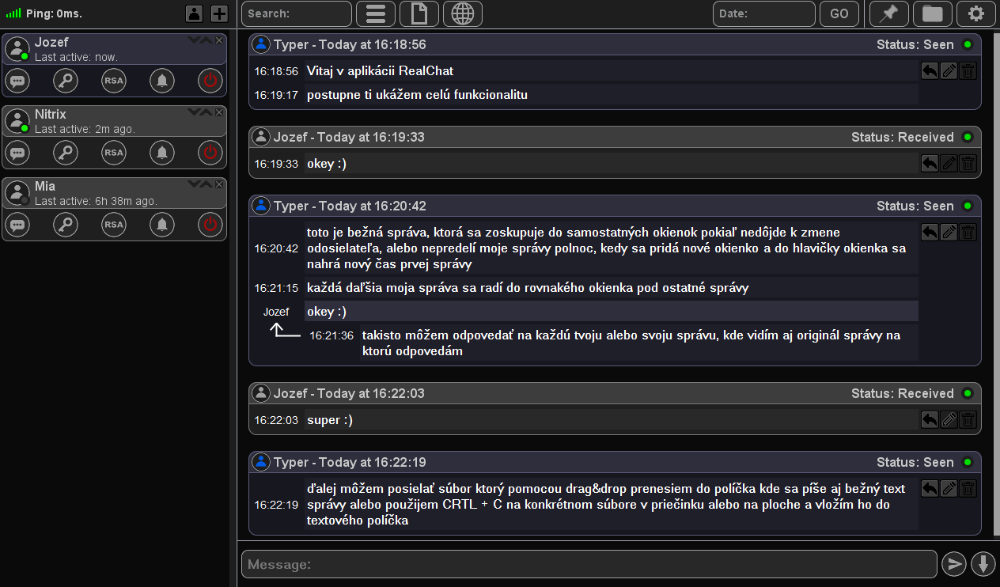

## Grafické zobrazenie správ
Blok správ má vo svojej hlavičke meno odosielateľa, čas odoslania / prijatia prvej správy a status poslednej správy, ktorá sa v ňom nachádza.

* **základná správa**
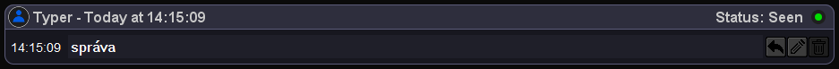
* **odpoveď**
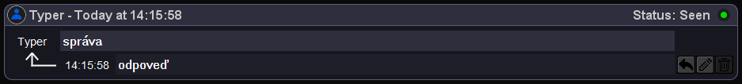
* **zreťazená odpoveď**
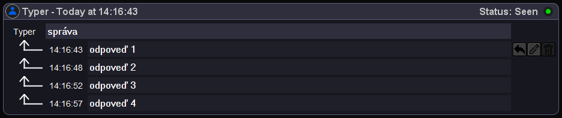
* **priama odpoveď**
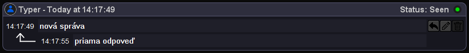
* **farebná správa #RGB**
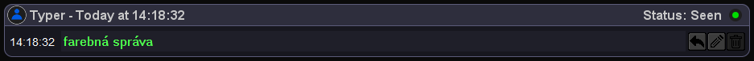
* **súbor**
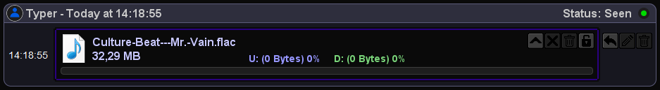
* **grafický súbor**
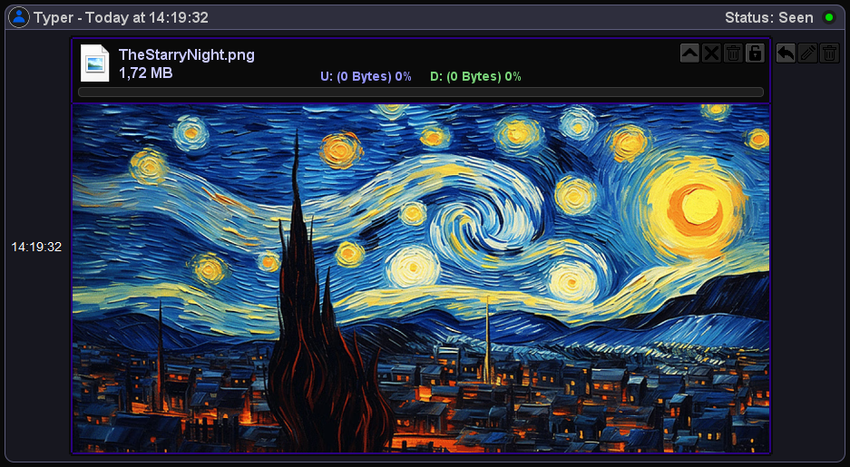
* **odpoveď na súbor**
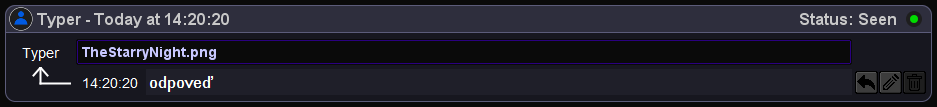
* **selekcia správy myšou**
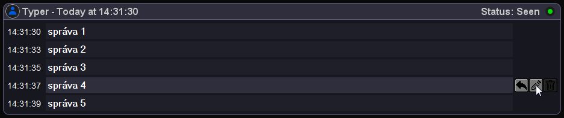
* **kliknuteľný odkaz**
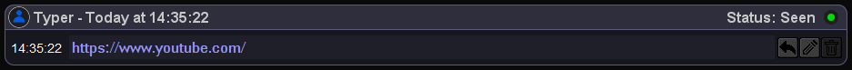
## Manipulácia so správami
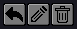

Každá správa má vedľa seba priradené 3 tlačítka na obsluhu.
Tieto tlačítka sú odpoveď na správu, editácia správy a zmazanie správy.

* **Answer** - Užívateľ môže kedykoľvek odpovedať na akúkoľvek správu (vrátane svojich) bez obmedzenia. Výhodou je odpovedanie na staré správy z histórie vrátane súborov, ktoré sa dajú otvoriť kliknutím na hlavičku odpovede.

* **Edit** - Užívateľ môže editovať iba svoje správy a to tie, ktoré boli odoslané v konkrétny deň do polnoci. Po polnoci sa staršie správy už nedajú editovať z dôvodu konzistentnosti histórie správ. Tlačítko editácie je pri týchto správach automaticky deaktivované prechodom času cez polnoc. Pri editácií textu vidia zmenu obaja užívatelia súčasne navyše sa príjmateľovi správy zobrazí odlišná ikona, ktorá signalizuje, že správa bola upravená. Táto signalizácia je už trvalá a viditeľná aj v histórií správ. 

* **Delete** - Užívateľ môže vymazať svoju správu iba do momentu, kedy táto správa nemá status `Seen` a to z praktických dôvodov, kedy je zmazanie videnej správy bezvýznamené. Po nadobudnutí tohto statusu sa príslušné tlačítko na mazanie deaktivuje. Po zmazaní je správa zmazaná odosielateľovi a taktiež príjmateľovi z prijatých alebo čakajúcich správ. Pri mazaní správy je vyžadované potvrdenie zmazania pre prípad nechceného stlačenia. 

## Statusy správ
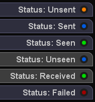

Každá správa má svoj jedinečný status, ktorý určuje jej aktuálny stav. Blok správ ukazuje vo svojej hlavičke status poslednej správy, ktorá sa v ňom nachádza z dôvodu, že celý blok správ môže byť označený ako `Seen` až po videní poslednej správy. Každá správa môže mať jeden zo šiestich možných statusov:

* **Unsent** - Status správy, ktorá ešte nebola odoslaná a čaká na odoslanie. Každá nová správa má ako prvý priradený práve tento status.

* **Sent** - Status správy, ktorá bola úspešne odoslaná priamo príjmateľovi, alebo na server do fronty kde čaká na pripojenie príjmateľa.

* **Seen** - Status oznamujúci odosielateľovi, že príjmateľ vašu správu videl.

* **Unseen** - Status správy, ktorá bola prijatá, ale ešte nebola zobrazená vo viditeľnej oblasti okna.

* **Received** - Status správy, ktorá bola prijatá a zobrazená vo viditeľnej oblasti okna.

* **Failed** - Status správy, ktorý by sa nemal bežne vyskytovať a je vyhradený na špecifické situácie zlyhaní.

Ak užívateľ po prijatí správy posunie scrollbar a správa sa dostane do viditeľnej oblasti okna zmení sa jej status z `Unseen` na `Received`. Odosielateľ je o tejto zmene okamžite upozornený zmenou statusu príslušnej správy z `Sent` na `Seen`.
Ak nie je odosielateľ pripojený tak všetky čakajúce dáta vo fronte na serveri vrátane zmeny statusu sa mu odošlú až po jeho pripojení.

## Priatelia

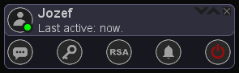

Priatelia predstavujú jednoduché rozhranie na správu užívateľou s ktorými komunikujete. Každé okienko priateľa je doplnené o sadu tlačítok na manipuláciu a nastavenie zabezpečenia správ.
Priateľa môžete pridať tlačítkami na vrchnej lište.  

Keďže sa jedná o súkromný chat potvrdenie pridania priateľa nie je potrebné. Druhému užívateľovi ste automaticky pridaný do bočného panelu.

## Blokácia

Užívateľ môže byť zablokovaný, alebo úplne vymazaný spolu s históriou správ.
Blokovaný užívateľ vás už nemôže naďalej kontaktovať a nevidí vašu aktivitu. Statusy `Blocked` a `Rejected` informujú o aktuálnom stave zablokovania.

* **Blocked** - boli ste zablokovaný.
* **Rejected** - zablokovali ste užívateľa.
* **Blocked & Rejected** - prechovávate k sebe vzájomné sympatie.

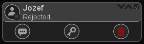

Užívateľa môžete kedykoľvek odblokovať použitím tlačítka v pravom hornom rohu okienka, alebo s tlačítkom koša úplne vymazať aj s históriou správ.

## Packety
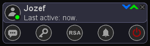

V pravom hornom rohu okienka sa nachádzaju aj kontrolky prenosu dát. Modrá informuje o prichádzajúcich packetoch od konkretného užívateľa. Zelená o odchádzajúcich packetoch tomuto užívateľovi. Každá kontrolka pri prechode konkretného packetu blikne na 50ms.

## Aktivita

Pod menom užívateľa sa nachádza status `Last active:` ktorý informuje o poslednej aktivite užívateľa v okne programu. Čas sa automaticky aktualizuje od poslednej aktivity užívateľa a je viditeľný aj ak je užívateľ odhlásený.

* **now** - Užívateľ bol / je aktívny v poslednej minúte
* **5m** - Neaktívny menej ako hodinu
* **12h 30m** - Neaktívny viac ako hodinu
* **01.01.2024 at 18:00:00** - Zobrazenie dátumu a času poslednej aktivity po 24 hodinách
* **Just left** - Užívateľ práve odišiel

Zelená gulička pri ikone užívateľa informuje o tom, či je užívateľ prihlásený alebo nie. Pri neaktivite prihláseného užívateľa mení plynule svoju farbu zo zelenej do červenej v rozmedzí 0 - 1h. Podľa tohto statusu môžete zistiť, či je váš priateľ tu, alebo už hodinu na obede, alebo zistiť, či tu bol keď ste tu neboli. Ak užívateľ nie je prihlásený gulička má šedú farbu.

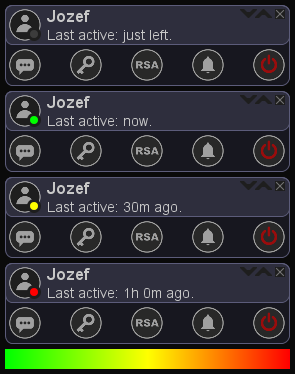

Konkrétny užívateľ môže byť podľa potreby deaktivovaný posledným tlačítkom vpravo. Vtedy ste pred ním totálne skrytý a prestávate mu odosielať všetky packety vrátane aktivity a online statusu. Vy však jeho aktivitu môžete stále vidieť a takisto vám môže naďalej posielať správy. Tieto správy si môžete pozrieť a odpovedať na ne až po opätovnej aktivácií tohto užívateľa.

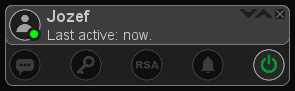

## Signalizácia správy

Nová správa je signalizovaná zmenou farby prvého tlačítka slúžiaceho na otvorenie správ a takisto aj zvukovou signalizáciou. Po zobrazení všetkých nových správ táto ikona automaticky zhasne.

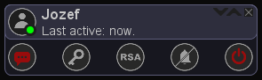

Ďalšie tlačítka slúžia na managment šifrovacích kľúčov, synchronizáciu `RSA` a vypnutie zvuku prichádzajúcej správy.

## Ping

Čas odozvy je zobrazený v ľavom hornom rohu programu a takisto na login page. Má informatívny charakter o kvalite a statuse pripojenia.
Odozva sa automaticky aktualizuje každých 500ms.
Po strate pripojenia sa zobrazí animácia modrej paličky a aplikácia sa automaticky snaží nadviazať spojenie so serverom.
Červené X signalizuje že sieť nie je dostupná.

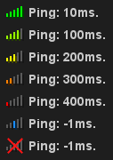

## Zabezpečenie

Medzi hlavnú funkcionalitu tejto aplikácie patrí šifrovanie správ a prenosu súborov.  
Na šifrovanie je použitý rozšírený `AES` algoritmus, ktorý používa 2048 bitový kľúč s počtom iterácií 64 namiesto 256 bitového kľúča s počtom iterácií 14. 

Pri kliknutí na čas správy si môže užívateľ skontrolovať, či je konkrétna správa zašifrovaná. Pri nešifrovaných správach je čas automaticky zafarbený na červeno ako priama signalizácia nezabezpečenej správy.

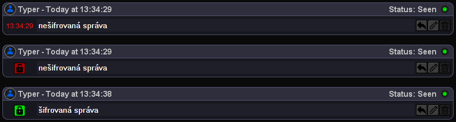

### O šifrovaní

Každá symetrická šifra vyžaduje, aby mali obaja komunikújúci rovnaký šifrovací kľúč s ktorým zabezpečujú svoje správy. 
Bez správneho kľúča nie je možné zašifrovanú správu dešifrovať späť do pôvodnej podoby. Pri dešifrovaní iným kľúčom akým bola správa zašifrovaná sa správa javí ako náhodná kombinácia dát.
Práve preto by mal byť šifrovací kľúč súkromný a poznať by ho mali iba účastníci komunikácie, aby bol splnený účel zabezpečenia. 
Ako však poslať konkrétny šifrovací kľúč druhému užívateľovi bez toho, aby to nikto na sieti nemohol zachytiť a tým pádom byť schopný dešifrovať správy ? 
Na to slúži asymetrická šifra `RSA` ktorá používa 2 rozdielne kľúče na šifrovanie a dešifrovanie dát.
Funguje na jednoduchom princípe, kedy užívateľ pošle druhému svoj vygenerovaný verejný kľúč. Druhý užívateľ jeho verejným kľúčom zašifruje dáta ktoré chce poslať a pošle ich naspäť prvému užívateľovi, ktorý je tieto dáta schopný dešifrovať iba svojím súkromným kľúčom, ktorý bol vygenerovaný spolu s verejným. Z verejného kľúča je nemožné alebo veľmi obtiažné získať súkromný kľúč. Obtiažnosť záleži od bitovej dĺžky kľúča. 
Tieto operácie sa dejú v programe automaticky. Užívateľ ovláda túto synchronizáciu dvoma tlačítkami.
Asymetrická povaha tejto šifry umožňuje, aby nikto, kto načúva od začiatku sieťovú komunikáciu nebol schopný odoslané dáta dešifrovať. 

### Synchronizácia kľúčov

Užívateľ pred synchronizáciou hlavných šifrovacích kľúčov najskôr vygeneruje a synchronizuje `RSA` verejné kľúče s druhým užívateľom.
Následne je možné pridať hlavné `AES` šifrovacie kľúče, kedy každý užívateľ predá druhému svoj vlastný náhodne vygenerovaný `AES` kľúč cez `RSA` algoritmus.

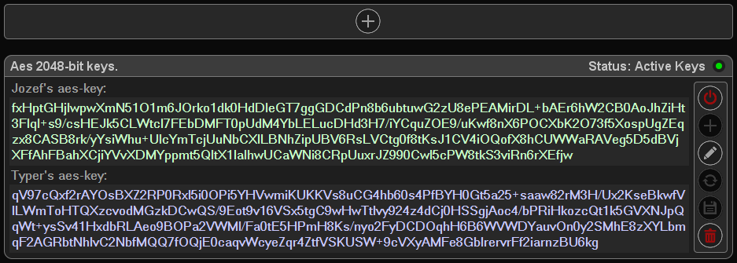

Hlavné kľúče môžu byť pridané aj manuálne bez nutnosti použiť `RSA` algoritmus.
Užívateľ môže kedykoľvek tieto kľúče upraviť, deaktivovať, zmazať alebo pridať.
Pri pridaní nových kľúčov sú staré kľúče deaktivované a používane iba na načítanie histórie správ. Nové správy sa šifrujú s novými kľúčmi. 

Kľúče sú zobrazované vo fromáte `Base64` pre minimalizáciu počtu znakov.

Každá poslaná správa má svoj jedinečný `Offset` vo forme 64 bitového čísla, ktoré je vstupným parametrom do šifrovacieho algoritmu spolu s dátami a kľúčom. `Offset` zaručuje, aby dve rovnaké správy nemali rovnakú podobu výstupných dát po zašifrovaní.
Predchádza sa tým analýze a iným technikám dešifrovania.

Každý užívateľ má uloženú celú históriu správ vo svojom počítači v šifrovanej podobe.
Server správy ukladá len na nevyhnutne potrebný čas, kedy čakajú na pripojenie príjemcu. Potom sú tieto šifrované správy automaticky vymazané.
Pre ochranu lokálne uložených správ a kľúčov je použitý `PBKDF2-HMAC-WHIRLPOOL` algoritmus na odvodenie hlavného aplikačného `AES` kľúča z vášho hesla, ktorý zabezpečuje aplikačné dáta v lokálnej databáze. To znamená, že ak zabudnete heslo od účtu, tak ste prišli o všetky správy. Je to však dobrá cena za skutočnú ochranu dát. V kritickej situácií je stále možné prekopírovanie dát od druhého užívateľa, ktorý ma svoju kópiu správ a kľúčov.

## Súbory

Aplikácia ponúka možnosť odosielania súborov a obrázkov. Každý súbor je počas prenosu šifrovaný spolu so svojím názvom. Ak príjemca nie je prihlásený súbor je automaticky uploadnutý na server, kde si ho vie príjemca neskôr stiahnuť.
Okienko súboru ponúka jednoduchý grafický dizajn so všetkými potrebnými informáciami. Výhodou je kliknuteľná ikona súboru, ktorá otvorí súbor v predvolenom programe. Prenos súborov je riadený manuálne tlačítkami. Užívateľ môže vynútiť upload príjemcovi ale túto funkciu si môže príjemca v nastaveniach vypnúť. Príjemca má rovnaké tlačítko so šípkou smerom dole, kde môže konkrétny súbor kedykoľvek stiahnúť.
Užívateľ môže súčasne posielať a sťahovať ľubovoľný počet súborov, záleží iba na kvalite pripojenia aká bude v tomto prípade rýchlosť prenosu.
Celistvosť dát je zabezpečená cez interný `Offset` a `CRC32` algoritmus.

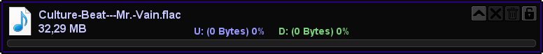

### Odosielanie

Pri odosielaní súboru priamo príjemcovi sa zobrazí zelený progressbar informujúci o aktuálnom priebehu sťahovania.
Sťahovanie / Prijímanie súboru je možné kedykoľvek prerušiť tlačítkom X a znovu spustiť. Nadviazanie z miesta prerušenia je výhodou pri posielaní veľmi veľkých súborov, kedy môže prerušiť prenos výpadok spojenia, alebo zaplnenie miesta na disku. 

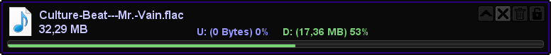

### Odosielanie na server

Pri odosielaní na server je zobrazený modrý progressbar. Táto funkcia je dostupná ak príjemca nie je prihlásený. Vtedy sa prenos automaticky presmeruje na server.
Na serveri je súbor uložený v šifrovanej podobe s náhodným názvom.

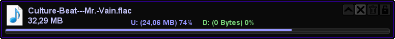

### Sťahovanie súboru zo serveru

Pri sťahovaní súboru zo serveru vidí príjemca status sťahovania a status súboru a aká veľká časť z neho bola nahratá na server.

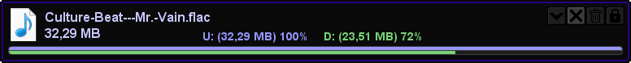

### Plné stiahnutie

Pri plnom stiahnutí / odoslaní má progressbar plnú bielu farbu. Odosielateľ môže súbor vymazať zo serveru, alebo vymazať prijímateľovi cez tlačítko delete, ak ma prijímateľ povolené toto nastavenie. Tlačítko zámku zabezpečuje, aby sa súbor dal kedykoľvek zamknúť a aby už nemohol byť sťahovaný. Zámok pri bežnej prevádzke funguje automaticky a manuálny zásah nie je potrebný.

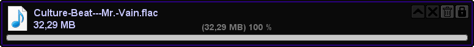

### Grafický súbor

Okienko súboru sa automaticky prispôsobuje veľkosti aktuálneho obrázku. Pri veľkých obrázkoch sa vytvára thumbnail v aplikačnej zložke pre rýchlejšie načítavanie histórie správ. Príjemcovi sa po stiahnutí dát súboru tento obrázok automaticky zobrazí. Odosielateľ vidí obrázok hneď po odoslaní správy.

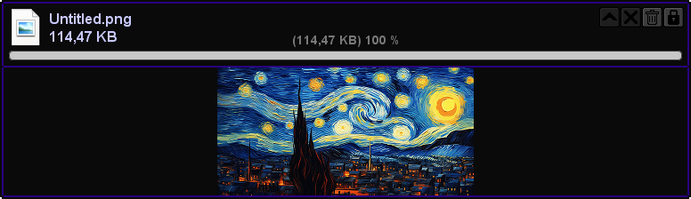

### Regulácia

Každý prenos má regulovanú rýchlosť odosielania dát podľa toho, aký má príjemca čas odozvy zo serveru. Predchádza sa tým zhodeniu príjemcu ak je jeho konektivita nestabilná. Odozva je meraná počas celého prenosu a automatická serverová regulácia zrýchľuje alebo spomaľuje prietok dát.
Takisto je chránený aj odosielateľ a rýchlosť jeho odosielania sa v tomto prípade prispôsobuje podľa vlastného času odozvy.

### Vloženie súboru

Súbory sa vkladajú do textového políčka pomocou metódy Drag & Drop alebo cez CTRL + C / V. Súbor je vyznačený modrou farbou a jeho názov sa nedá editovať.

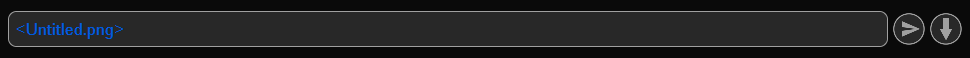

## Typing...
Užívateľ je informovaný o tom, či jeho priateľ práve niečo píše. Táto informácia sa zobrazuje ako animácia za sebou blikajúcich guličiek v ľavom dolnom okraji textového políčka.
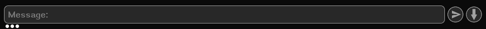

## Vyhľadávanie

Užívateľ môže v histórií správ vyhľadať akýkoľvek úsek textu, názov súboru, alebo webový odkaz.
Na paneli správ sa zobrazia iba správy, ktoré sa zhodujú s hľadaným výrazom. Súbory a webové odkazy je možné zobraziť aj bez zadania výrazu. Vtedy sa zobrazia zoradené podľa času odoslania.

## Skok na konkrétny dátum

Pri zadaní času a dátumu vo formáte `dd.MM.yyyy HH:mm:ss` je možné bez zdĺhavého scrollovania skočiť na konkrétny čas v histórií správ. Správy sa po skoku pri scrollovaní postupne načítavajú z databázy smerom hore aj dole.

## Nastavenia

Užívateľ má k dispozícii pár základných nastavení, kde je možné aj farebné prispôsobenie vzhľadu správ.

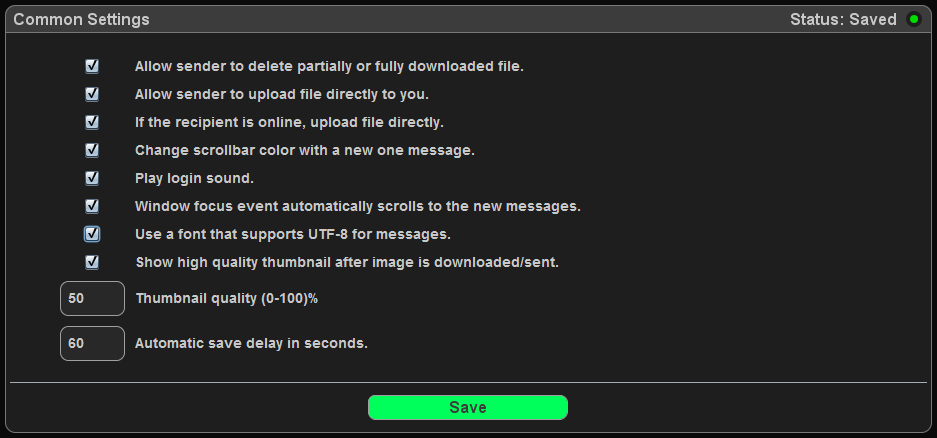

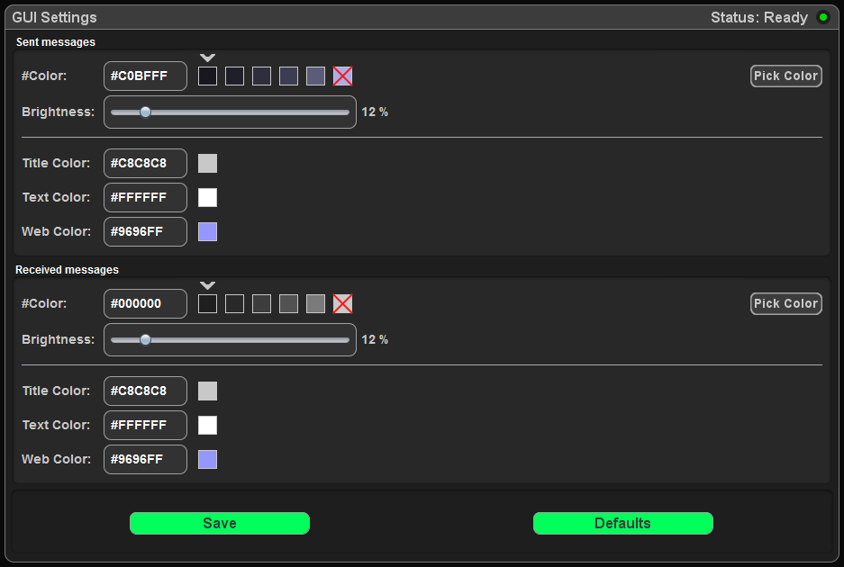

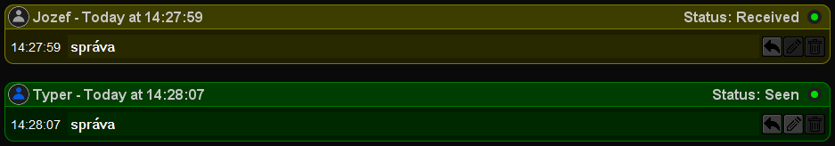

## The Easter Egg

Na login page sa v období sviatkov 24 až 26 decembra zobrazuje animácia sneženia ako grafický doplnok, ktorý ma za úlohu prekvapiť a potešiť užívateľa.

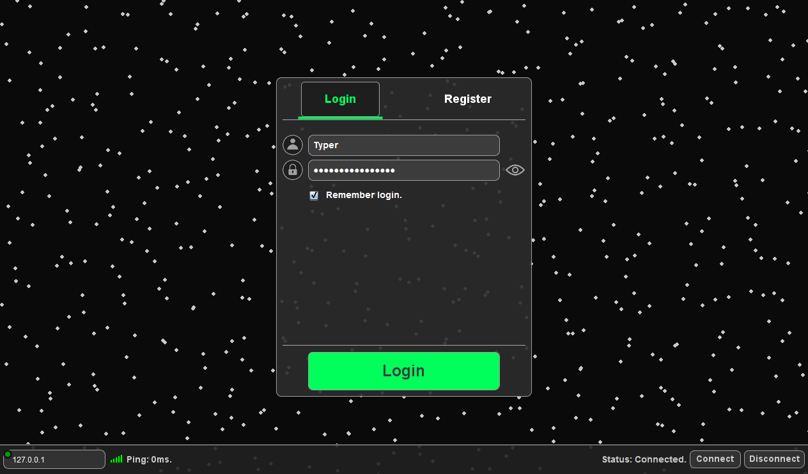

## Ostatné

* Aplikácia využíva na uloženie svojich dát H2 databázu.
* Registrácia je možná len s použitím `ProductKey` pretože sa jedná o súkromnú aplikáciu.
* Aktuálna verzia aplikácie v7.2
* Všetky aplikačné dáta na screenoch sú fiktívne a vytvorené iba pre účely tejto prezentácie.

_Dizajn aplikácie ako aj jej funkcionality sú chránené príslušnými ustanoveniami zákonov o ochrane priemyselného vlastníctva a autorským zákonom._
